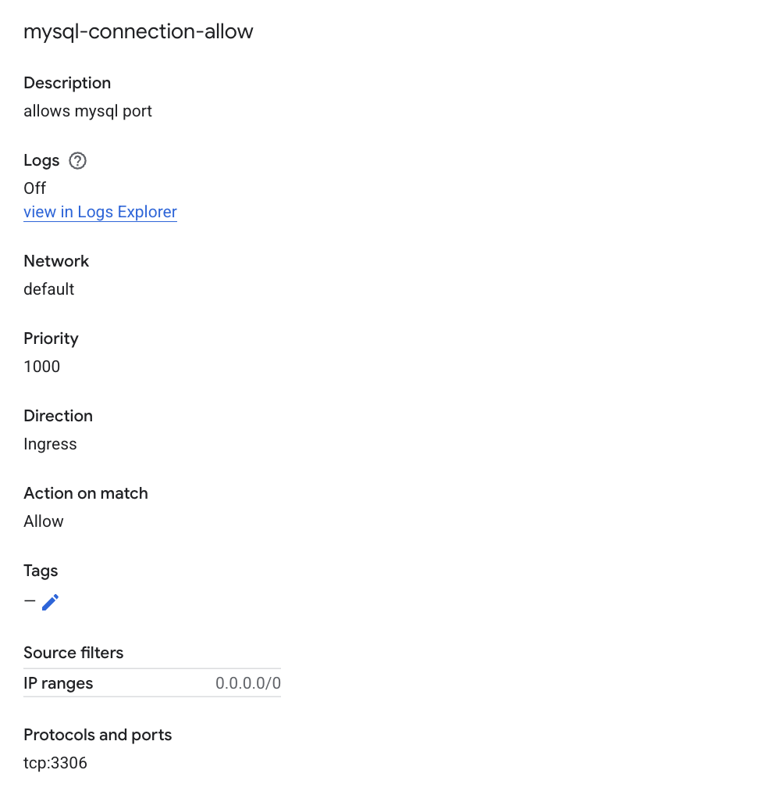
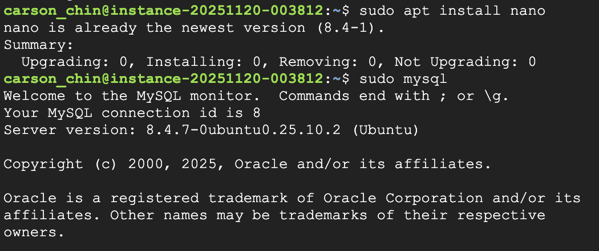
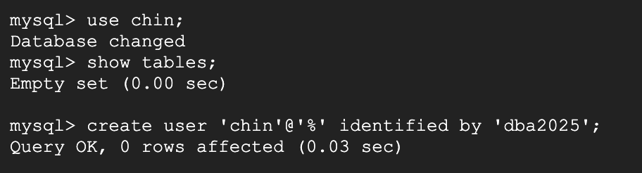
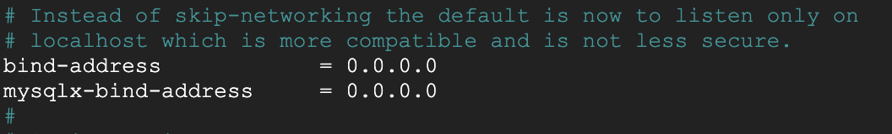
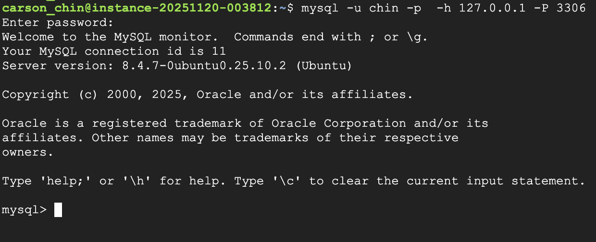
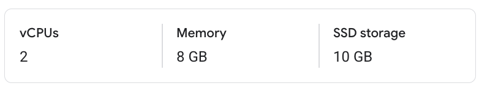
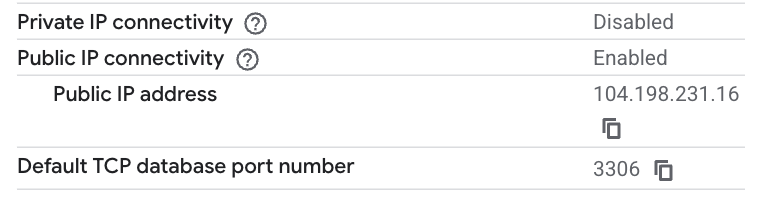

### Task A - MySQL on a VM (Self-managed)
1. **Provision VM**

   * OS: Ubuntu LTS
   * Instance type: e2-micro (2 vCPUs, 1 GB Memory)
   * Open **TCP ports 22 and 3306** 
   * 
2. **Install & Configure MySQL**

   * Install server packages; enable and start service.
        * 
   * Set strong root password (or auth plugin).
        * 
   * Edit `mysqld.cnf` (bind-address), restart service.
        * 
   * Configure firewall/security group rules minimally; note your choices in `setup_notes_vm.md`.

3. **Test Locally or Inside of Cloud Console (VS Code in GCP) environment **

   * `mysql -u <user> -p -h 127.0.0.1 -P 3306` from VM
        * 
   * Optional: set up an SSH tunnel from your dev machine instead of opening 3306 publicly.

### Task B — Managed MySQL

Create the provider’s managed MySQL with a small tier. Capture:

* Engine version, vCPU/RAM tier
    * 
* Network model (public IP allowlist)
    * 
* Initial admin user, DB name
    * carson-ahi-2025:us-central1:chin-delete-later-hha504
* Any automatic backups/HA configuration chosen
    * 
